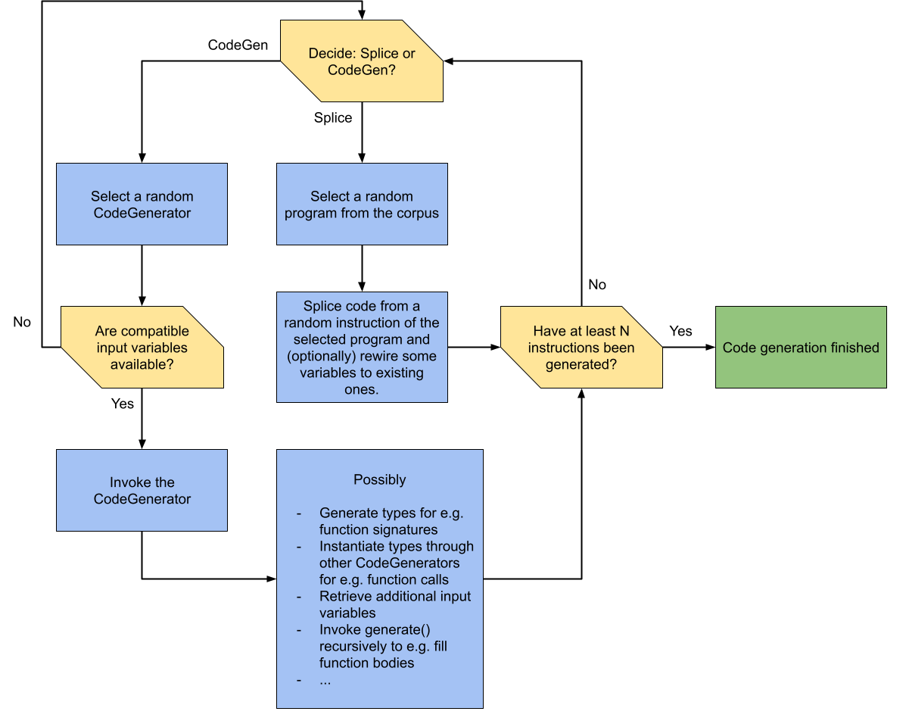

# How Fuzzilli Works

This document aims to explain how Fuzzilli generates JavaScript code and how it can be tuned to search for different kinds of bugs. Fuzzilli features two separate engines: the older mutation engine and the newer, still mostly experimental and not yet feature-complete, hybrid engine, which is essentially a combination of a purely generative component coupled with existing mutations. Before explaining how these engines work, this document first explains FuzzIL, the custom intermediate language around which Fuzzilli is built.

All of the mechanisms described in this document can be observed in action by using the `--inspect=history` CLI flag. If enabled, programs written to disk (essentially the programs in the corpus as well as crashes) will have an additional .history file describing the "history" of the programs, namely the exact mutation, splicing, code generation, etc. steps that were performed to generate it.

This document is both a living document, describing how Fuzzilli currently works, and a design doc for future development, in particular of the hybrid engine which is not yet feature complete.

## Goals of Fuzzilli
Besides the central goal of generating "interesting" JavaScript code, Fuzzilli also has to deal with the following two problems.

### Syntactical Correctness
If a program is syntactically invalid, it will be rejected early on during processing in the engine by the parser. Since Fuzzilli doesn’t attempt to find bugs in the language parsers, such an execution would thus effectively be wasted. As such, Fuzzilli strives to achieve a 100% syntactical correctness rate. This is achieved by construction through the use of FuzzIL, discussed next, which can only express syntactically valid JavaScript code.

### Semantic Correctness
In Fuzzilli, a program that raises an uncaught exception is considered to be semantically incorrect, or simply invalid. While it would be possible to wrap every (or most) statements into try-catch blocks, this would fundamentally change the control flow of the generated program and thus how it is optimized by a JIT compiler. Many JIT bugs can not be triggered through such a program. As such, it is essential that Fuzzilli generates semantically valid samples with a fairly high degree (as a baseline, Fuzzilli should aim for a correctness rate of above 50%).

This challenge is up to each engine, and will thus be discussed separately for each of them.

## FuzzIL
Implementation: [FuzzIL/](https://github.com/googleprojectzero/fuzzilli/tree/master/Sources/Fuzzilli/FuzzIL) subdirectory

Fuzzilli is based on a custom intermediate language, called FuzzIL. FuzzIL is designed with four central goals:

* Facilitating meaningful code mutations
* Being easy to reason about statically (see the section about the AbstractInterpreter)
* Being easy to lift to JavaScript
* Ensuring certain correctness properties of the resulting JavaScript code, such as syntactic correctness and definition of variables before their use

Fuzzilli internally exclusively operates on FuzzIL programs and only lifts them to JavaScript for execution. The high-level fuzzing pipeline with FuzzIL thus looks like this:


Lifting is performed by the [JavaScriptLifter](https://github.com/googleprojectzero/fuzzilli/blob/master/Sources/Fuzzilli/Lifting/JavaScriptLifter.swift) while the execution of the JavaScript code happens through the [REPRL](https://github.com/googleprojectzero/fuzzilli/blob/master/Sources/Fuzzilli/Execution/REPRL.swift) (read-eval-print-reset-loop) mechanism, which is in essence an implementation of [persistent fuzzing](https://lcamtuf.blogspot.com/2015/06/new-in-afl-persistent-mode.html) for JS engines that also provides feedback about whether the execution succeeded or not (it failed if the execution was terminated by an uncaught exception).

FuzzIL programs can be serialized into [protobufs](https://github.com/googleprojectzero/fuzzilli/blob/master/Sources/Fuzzilli/Protobuf/program.proto), which is done to store them to disk or [send them over the network](https://github.com/googleprojectzero/fuzzilli/blob/master/Sources/Fuzzilli/Modules/NetworkSync.swift) in the case of distributed fuzzing. A FuzzIl program in protobuf format can be converted to JavaScript or to FuzzIL’s textual representation using the FuzzILTool:

`swift run FuzzILTool --liftToFuzzIL path/to/program.protobuf`

An imaginary FuzzIL sample might look like this

```
v0 <- BeginPlainFunctionDefinition -> v1, v2, v3
    v4 <- BinaryOperation v1 '+' v2
    StoreProperty v3, 'foo', v4
EndPlainFunctionDefinition
v5 <- LoadString "Hello World"
v6 <- CreateObject ['bar': v5]
v7 <- LoadFloat 13.37
v8 <- CallFunction v0, [v7, v7, v6]
```

When inlining intermediate expressions, the same program lifted to JavaScript code could look like this

```javascript
function v0(v1, v2, v3) {
    v3.foo = v1 + v2;
}
const v6 = {bar: "Hello World"};
v0(13.37, 13.37, v6);
```

Or could look like this when using a trivial lifting algorithm:

```javascript
function v0(v1, v2, v3) {
    const v4 = v1 + v2;
    v3.foo = v4;
}
const v5 = "Hello World";
const v6 = {bar: v5};
const v7 = 13.37;
const v8 = v0(v7, v7, v6);
```

Ultimately, the used lifting algorithm likely doesn’t matter too much since the engine's bytecode and JIT compiler will produce mostly identical results regardless of the syntactical representation of the code.

FuzzIL has a number of properties:
* A FuzzIL program is simply a list of instructions.
* Every FuzzIL program can be lifted to syntactically valid JavaScript code.
* A FuzzIL instruction is an operation together with input and output variables and potentially one or more parameters (enclosed in single quotes in the notation above).
* Every variable is defined before it is used, and variable numbers are ascending and contiguous.
* Control flow is expressed through "blocks" which have at least a Begin and and End operation, but can also have intermediate operations, for example BeginIf, BeginElse, EndIf.
* Block instructions can have inner outputs (those following a '->' in the notation above) which are only visible in the newly opened scope (for example function parameters).
* Inputs to instructions are always variables, there are no immediate values.
* Every output of an instruction is a new variable, and existing variables can only be reassigned through dedicated operations such as the `Reassign` instruction.

## Mutating FuzzIL Code
FuzzIL is designed to facilitate various code mutations. In this section, the central mutations are explained.

It should be noted that [programs](https://github.com/googleprojectzero/fuzzilli/blob/master/Sources/Fuzzilli/FuzzIL/Program.swift) in Fuzzilli are immutable, which makes it easier to reason about them. As such, when a program is mutated, it is actually copied while mutations are applied to it. This is done through the [ProgramBuilder class](https://github.com/googleprojectzero/fuzzilli/blob/master/Sources/Fuzzilli/Core/ProgramBuilder.swift), a central component in Fuzzilli which allows [generating new instructions](https://github.com/googleprojectzero/fuzzilli/blob/ce4738fc571e2ef2aa5a30424f32f7957a70b5f3/Sources/Fuzzilli/Core/ProgramBuilder.swift#L816) as well as [appending existing ones](https://github.com/googleprojectzero/fuzzilli/blob/ce4738fc571e2ef2aa5a30424f32f7957a70b5f3/Sources/Fuzzilli/Core/ProgramBuilder.swift#L599) and provides various kinds of information about the program under construction, such as which variables are currently visible.

### Input Mutator
Implementation: [InputMutator.swift](https://github.com/googleprojectzero/fuzzilli/blob/master/Sources/Fuzzilli/Mutators/InputMutator.swift)

This is the central data flow mutation. In essence, it simply replaces an input to an instruction with another, randomly chosen one:

```
StoreProperty v3, 'foo', v4
```

Might become

```
StoreProperty v3, 'foo', v2
```

Due to the design of FuzzIL, in particular the fact that all inputs to instructions are variables, this mutation requires only a handful of LOCs to implement.

### Operation Mutator
Implementation: [OperationMutator.swift](https://github.com/googleprojectzero/fuzzilli/blob/master/Sources/Fuzzilli/Mutators/OperationMutator.swift)

Another fundamental mutation which mutates the parameters of an operation (the values enclosed in single quotes above). For example:

```
v4 <- BinaryOperation v1 '+' v2
```

Might become

```
v4 <- BinaryOperation v1 '/' v2
```

### Splicing
Implementation: [Implemented as part of the ProgramBuilder class](https://github.com/googleprojectzero/fuzzilli/blob/ce4738fc571e2ef2aa5a30424f32f7957a70b5f3/Sources/Fuzzilli/Core/ProgramBuilder.swift#L619)

The idea behind splicing is to copy a self-contained part of another program into the one that is currently being mutated. Consider the following program:

```
v0 <- LoadInt '42'
v1 <- LoadFloat '13.37'
v2 <- LoadBuiltin 'Math'
v3 <- CallMethod v2, 'sin', [v1]
v4 <- CreateArray [v3, v3]
```

In its simplest form, splicing from the CallMethod instruction would result in the three middle instructions being copied into the current program. This also requires renaming variables so they don’t collide with existing variables:

```
... existing code
v13 <- LoadFloat '13.37'
v14 <- LoadBuiltin 'Math'
v15 <- CallMethod v14, 'sin', [v13]
... existing code
```

Splicing ultimately helps combine different features from multiple programs into a single program.

A trivial variant of the splice mutation is the [CombineMutator](https://github.com/googleprojectzero/fuzzilli/blob/master/Sources/Fuzzilli/Mutators/CombineMutator.swift) which simply inserts another program in full into the currently mutated one. In that case, the splice is essentially the entire program.

Fuzzilli [also features](https://github.com/googleprojectzero/fuzzilli/commit/643ac76336520b0cf67ae7feefbe4882908a8fa8) a more sophisticated implementation of splicing which is able to connect the dataflow of the inserted code with the existing program by searching for "matching" variable substitutions in the existing code. This is possible through the type system, discussed below. With that, splicing from the above program could also result in the following:

```
... existing code
v7 <- ... some operation that results in a float
... existing code
v14 <- LoadBuiltin 'Math'
v15 <- CallMethod v14, 'sin', [v7]
... existing code
```

### Code Generation
Implementation: [CodeGenMutator.swift](https://github.com/googleprojectzero/fuzzilli/blob/master/Sources/Fuzzilli/Mutators/CodeGenMutator.swift)

The final fundamental mutation is code generation. This mutator generates new, random code at one or multiple random positions in the mutated program.

Code generation is performed through "CodeGenerators": small functions that generate a specific code fragment, often just a single FuzzIL instruction, while (usually) using existing variables as inputs if required. A very simple code generator would be the following:

```swift
CodeGenerator("IntegerGenerator") { b in
    b.loadInt(b.genInt())
}
```

This generator emits a LoadInteger instruction that creates a new variable containing a random integer value (technically, not completely random since [genInt()](https://github.com/googleprojectzero/fuzzilli/blob/ce4738fc571e2ef2aa5a30424f32f7957a70b5f3/Sources/Fuzzilli/Core/ProgramBuilder.swift#L128) will favor some ["interesting" integers](https://github.com/googleprojectzero/fuzzilli/blob/ce4738fc571e2ef2aa5a30424f32f7957a70b5f3/Sources/Fuzzilli/Core/JavaScriptEnvironment.swift#L20)). Another example code generator might be:

```swift
CodeGenerator("ComparisonGenerator") { b in
    let lhs = b.randVar()
    let rhs = b.randVar()
    b.compare(lhs, rhs, with: chooseUniform(from: allComparators))
}
```

This generator emits a comparison instruction (e.g. `==`) comparing two existing variables.

The default code generators can be found in [CodeGenerators.swift](https://github.com/googleprojectzero/fuzzilli/blob/master/Sources/Fuzzilli/Core/CodeGenerators.swift) while custom code generators can be added for specific engines, for example to [trigger different levels of JITing](https://github.com/googleprojectzero/fuzzilli/blob/master/Sources/FuzzilliCli/Profiles/JSCProfile.swift).

Code generators are stored in a weighted list and are thus selected with different, currently [manually chosen weights](https://github.com/googleprojectzero/fuzzilli/blob/master/Sources/FuzzilliCli/CodeGeneratorWeights.swift) (it would be nice to eventually have these [weights be selected automatically](https://github.com/googleprojectzero/fuzzilli/issues/172) though). This allows some degree of control over the distribution of the generated code, for example roughly how often arithmetic operations or method calls are performed, or how much control flow (if-else, loops, ...) is generated relative to data flow. Furthermore, CodeGenerators provide a simple way to steer Fuzzilli towards certain bug types by adding CodeGenerators that generate code fragments that have frequently resulted in bugs in the past, such as prototype changes, custom type conversion callbacks (e.g. valueOf), or indexed accessors.

The CodeGenerators allow Fuzzilli to start from a single, arbitrarily chosen initial sample (or, in theory, also from no corpus at all):

```javascript
let v0 = Object();
```

Through the code generators, all relevant language features (e.g. object operations, unary and binary operations, etc.) will eventually be generated, then kept in the corpus (because they trigger new coverage) and further mutated afterwards.

### Additional Mutations?
There is room for additional mutations, for example ones that specifically target control flow. Possible options include duplicating existing code fragments or moving them around in the program. This is subject to further research.

## The Abstract Interpreter and the Type System
Implementation: [AbstractInterpreter.swift](https://github.com/googleprojectzero/fuzzilli/blob/master/Sources/Fuzzilli/FuzzIL/AbstractInterpreter.swift)

Up to this point, a code generator is a simple function that fetches zero or more random input variables and generates some new FuzzIL instructions to perform some operations on them. Now consider the following, imaginary code generator:

```swift
CodeGenerator("FunctionCallGenerator") { b in
    let function = b.randVar()
    let arguments = [b.randVar(), b.randVar(), b.randVar()]
    b.callFunction(f, with: arguments)
}
```

This generator selects a random, currently visible variable, then calls it as a function with three random arguments.

The problem here is that since only a small number of variables at any given time are actually functions, this generator will end up generating a lot of invalid function calls, such as the following:

```
v3 <- LoadString "foobar"
v4 <- CallFunction v3, []
// TypeError: v3 is not a function
```

This will cause a runtime exception to be thrown which then results in the rest of the program to not be executed and the program being considered invalid.

To deal with this problem, Fuzzilli implements a relatively simple abstract interpreter which attempts to infer the possible types of every variable while a program is constructed by the ProgramBuilder. This is (likely) easier than it sounds since the interpreter only needs to be correct most of the time (it’s basically an optimization), not always. This significantly simplifies the implementation as many operations with complex effects, such as prototype changes, can largely be ignored. As an example, consider the rules that infer the  results of the typeof, instanceof, and comparison operations:

```swift
case is TypeOf:
    set(instr.output, environment.stringType)

case is InstanceOf:
    set(instr.output, environment.booleanType)

case is Compare:
    set(instr.output, environment.booleanType)
```

To correctly infer the types of builtin objects, methods, and functions, the abstract interpreter relies on a [static model of the JavaScript runtime environment](https://github.com/googleprojectzero/fuzzilli/blob/master/Sources/Fuzzilli/Core/JavaScriptEnvironment.swift) which can, for example, tell the interpreter that the eval builtin is a function that expects a single argument, that the Object builtin is an object with various methods, or that the Uint8Array builtin is a constructor that returns a Uint8Array instance, which then has a certain set of properties and methods.

FuzzIL is designed to make the abstract interpreter’s job as simple as possible. As an example, consider the implementation of ES6 classes. In FuzzIL, they look roughly like this:

```
v0 <- BeginClassDefinition '$properties', '$methods' -> v1 (this), v2, v3
    ... constructor code
BeginMethodDefinition -> v4 (this), v5
    ... implementation of method 1
BeginMethodDefinition -> v6 (this)
    ... implementation of method 2
EndClassDefinition
```

The important bit here is that all type information about the class’ instances (namely, the properties and methods as well as their signatures) is stored in the BeginClassDefinition instruction. This enables the AbstractInterpreter to correctly infer the type of the `this` parameter (the first parameter) in the constructor and every method without having to parse the entire class definition first (which would be impossible if it is just being generated). This in turn enables Fuzzilli to perform meaningful operations (e.g. property accesses or method calls) on the `this` object.

With type information available, the CodeGenerator from above can now request a variable containing a function and can also attempt to find variables compatible with the function’s parameter types:

```swift
CodeGenerator("FunctionCallGenerator") { b in
    let function = b.randVar(ofType: .function())
    let arguments = b.randArguments(forCalling: function)
    b.callFunction(f, with: arguments)
}
```

It is important to note that, for mutation-based fuzzing, the AbstractInterpreter and the type system should be seen as optimizations, not essential features, and so the fuzzer must still be able to function without type information. In addition, while the use of type information for mutations can improve the performance of the fuzzer (less trivially incorrect samples are produced), too much reliance on it might restrict the fuzzer and thus affect the performance negatively (less diverse samples are produced). An example of this is the InputMutator, which can optionally be type aware, in which case it will attempt to find "compatible" replacement variables. In order to not restrict the fuzzer too much, Fuzzilli's MutationEngine is currently configured to use a non-type-aware InputMutator twice as often as a type-aware InputMutator.

### Type System
Implementation: [TypeSystem.swift](https://github.com/googleprojectzero/fuzzilli/blob/master/Sources/Fuzzilli/FuzzIL/TypeSystem.swift)

To do its job, the AbstractInterpreter requires a type system. FuzzIL’s type system is designed to support two central use cases:

* Determining the operations that can be performed on a given variable. For example, the type system is expected to state which properties and methods are available on an object and what their types and signatures are.
* Finding a compatible variable for a given operation. For example, a function might require a certain argument type, e.g. a Number or a Uint8Array. The type system must be able to express these types and be able to identify variables that store a value of this type or of a subtype. For example, a Uint8Array with an additional property can be used when a Uint8Array is required, and an object of a subclass can be used when the parent class is required.

Both of these operations need to be efficient as they will be performed frequently.

The type system is constructed around bitsets, with the base types represented each by a single bit in a 32bit integer:

```swift
static let undefined   = BaseType(rawValue: 1 << 0)
static let integer     = BaseType(rawValue: 1 << 1)
static let float       = BaseType(rawValue: 1 << 2)
static let string      = BaseType(rawValue: 1 << 3)
static let boolean     = BaseType(rawValue: 1 << 4)
static let bigint      = BaseType(rawValue: 1 << 5)
static let object      = BaseType(rawValue: 1 << 6)
static let array       = BaseType(rawValue: 1 << 7)
static let function    = BaseType(rawValue: 1 << 8)
static let constructor = BaseType(rawValue: 1 << 9)
```

Each base type expresses that certain actions can be performed of a value of its type (use case 1.). For example, the numerical types express that arithmetic operations can be performed on its values, the .array type expresses that the value can be iterated over (e.g. through a for-of loop or using the spread operator), the .object type expresses that the value has properties and methods that can be accessed, and the .function type expresses that the value can be invoked using a function call.

Additional type information, for example the properties and methods, the signatures of functions, or the element type of arrays, is stored in "type extension" objects which can be shared between multiple Type structs (to reduce memory consumption).

The base types can be combined to form more complex types using three operators: union, intersection, and merge. These are discussed next.

#### Union Operator
Operator: | (bitwise or)

A union expresses that a variable has one type or the other: the type `t1 | t2` expresses that a value is either a `t1` or a `t2`.

In Fuzzilli, union types can frequently occur as in- or output types of functions. For example, the [`String.prototype.replace`](https://developer.mozilla.org/en-US/docs/Web/JavaScript/Reference/Global_Objects/String/replace) method can take both a regular expression object or a string as first parameter: `"replace" : [.string | .jsRegExp, .string] => .jsString`. In addition, union types also occur due to conditional execution:

```javascript
let v4 = 42; 		// .integer
if (v2) {
    v4 = "foobar"; 	// .string
}
// v4 = .integer | .string
```

#### Intersection Operator
Operator: & (bitwise and)

The intersection operator computes the intersection between two (union) types. For example, the intersection of `t1 | t2` with `t1 | t3` is `t1`.

In Fuzzilli, this operator is used to determine whether a variable may have a certain type, for example whether it could be a BigInt, in which case the resulting type of many arithmetic operators should also include BigInt.

#### Merge Operator
Operator: + (plus)

This operator is probably the least intuitive and is likely somewhat unique to this type system.

In essence, if a variable has the merged type `t1 + t2` then it is both input types at the same time. As such, it can be used whenever one of the original types is required. To see why this can be useful, consider a few common JavaScript values:

**A string: `"foobar"`**
While the JavaScript string is clearly of type "string", meaning it can for example be used to do string concatenation, it is also an object with properties (e.g. `.length`) and methods (e.g. `.charCodeAt`). Furthermore, it also behaves as an array as it can be iterated and spread. As such, a JavaScript string would be of type `.string + .object(...) + .array`

**A function: `function foo(...) { ... }`**
A JavaScript function is both a function (it can be called) as well as an object (it has properties and methods). As such, the type would be `.function(...) + .object(...)`

**An array: `[ ... ]`**
A JavaScript array is iterable, but also contains properties and methods and is thus represented by `.array + .object(...)`.

In essence, merge types allow FuzzIL to model the dynamic nature of the JavaScript language, in particular the implicit type conversions that are frequently performed and the fact that many things are (also) objects.

#### Type Subsumption
Operation: <= and >=

To support type queries (use case 2.), the type system implements a subsumption relationship between types. This can be thought of as the "is a" relationship and should generally be used when searching for "compatible" variables for a given type constraint.

The general subsumption rules are:
* Base types only subsume themselves (an integer is an integer but not a string)
* A union `t1 | t2` subsumes both `t1` and `t2` (a string is a "string or number")
* A merged type `t1 + t2` is subsumed by both `t1` and `t2` (a JavaScript function is both a function and an object with properties and methods)
* Inheritance relationships (including added properties/methods) work as expected: a Uint8Array with an additional property is still a Uint8Array. An instance of a subclass is also an instance of the parent class.

#### Implementation Details
Types are implemented as two 32bit integers, one storing the definite type and one storing the possible type. As a rule of thumb, the definite type grows through merging and the possible type grows through unioning.

Due to this representation, a type can generally either be a union type or a merged type. For example, it is not possible (if attempted, it will result in a runtime error) to merge union types, as this couldn’t be properly represented. In practice, however, this is not required and thus unproblematic. Unioning merged types is supported, however, the result is usually too broad. For example, the type `(t1 + t2) | (t3 + t4)` would be indistinguishable from the type `t1 | t2 | t3 | t4`. The result type is thus broader than necessary but still correct in the sense that the resulting type subsumes both input types. In practice, again, this does not really matter since this case only occurs during conditional execution, in which case the resulting type can probably not be used in a meaningful way anyway (it isn’t guaranteed to be any of the types, so it can’t be used when one of them is required).

#### Type Examples
To give a better understanding of FuzzIL’s type system, this section shows a few common JavaScript values and what their type in FuzzIL would be. This can also be inspected by using the `--inspect=types` flag. If enabled, programs written to disk will include the types of variables as comments.

```javascript
let v0 = "foobar";
// .string + .object(...) + .array
// the object part contains all the standard string methods and properties

let v0 = { valueOf() { ...; return 13.37; }};
// .object(...) + .float
// The object can be used for numerical operations since it has a meaningful
// conversion operator defined (a custom valueOf method with known signature).
// Note: this is not yet implemented, currently the type would just be .object

let v0 = [...];
// .array + .object(...)
// the JavaScript array is clearly an array (can be iterated over) but also
// exposes properties and methods and as such is also an object

class v0 { ... foo() { ... }; bar() { ... } };
// .constructor([...] => .object(...))
// The variable v0 is a constructor with the parameters indicated by its
// constructor and which returns an object of the v0 "group" with certain
// properties and methods (e.g. foo and bar)
```

## The Mutation Engine
Implementation: [MutationEngine.swift](https://github.com/googleprojectzero/fuzzilli/blob/master/Sources/Fuzzilli/Core/MutationEngine.swift) (--engine=mutation)

This section will explain how Fuzzilli’s mutation engine works. For that, it first covers three of the missing components of the mutation engine, namely the minimizer, the corpus, and coverage collection, then explains the high-level fuzzing algorithm used by the mutation engine.

### Minimization
Implementation: [Minimization/](https://github.com/googleprojectzero/fuzzilli/tree/master/Sources/Fuzzilli/Minimization) subdirectory

The mutations that Fuzzilli performs all share a common aspect: they can only increase the size (the number of instructions) of a FuzzIL program, but never decrease it. As such, after many rounds of mutations, programs would eventually become too large to execute within the time limit. Moreover, if unnecessary features are not removed from interesting programs, the efficiency of future mutations degrades, as many mutations will be "wasted" mutating irrelevant code. As such, Fuzzilli requires a minimizer that removes unnecessary code from programs before they are inserted into the corpus.

Minimization is conceptually simple: Fuzzilli attempts to identify and remove instructions that are not necessary to trigger the newly discovered coverage edges. In the simplest case, this means [removing a single instruction, then rerunning the program to see if it still triggers the new edges](https://github.com/googleprojectzero/fuzzilli/blob/master/Sources/Fuzzilli/Minimization/GenericInstructionReducer.swift). There are also a few specialized minimization passes. For example, there is an [inlining reducer](https://github.com/googleprojectzero/fuzzilli/blob/master/Sources/Fuzzilli/Minimization/InliningReducer.swift) which attempts to inline functions at their callsite. This is necessary since otherwise code patterns such as

```javascript
function v1(...) {
    function v2(...) {
        function v3(...) {
        }
        v3(...);
    }
    v2(...);
}
v1(...);
```

would build up over time, for example when splicing function calls and definitions from another program into the current one.

As can be imagined, minimization is very expensive, frequently requiring over a hundred executions. However, while the minimization overhead dominates in the early stages of fuzzing (when interesting samples are frequently found), it approaches zero in the later stages of fuzzing when new, interesting programs are rarely found.

It is possible to tune the minimizer to remove code less aggressively through the `--minimizationLimit=N` CLI flag. With that, it is possible to force the minimizer to keep minimized programs above a given number of instructions. This can help retain some additional code fragments which might facilitate future mutations. This can also speed up minimization a bit since less instructions need to be removed. However, setting this value too high will likely result in the same kinds of problems that the minimizer attempts to solve in the first place.

### Corpus
Implementation: [Corpus.swift](https://github.com/googleprojectzero/fuzzilli/blob/master/Sources/Fuzzilli/Core/Corpus.swift)

Fuzzilli keeps "interesting" samples in its corpus for future mutations. In the default corpus implementation, samples are added , then mutated randomly, and eventually "retired" after they have been mutated at least a certain number of times (controllable through `--minMutationsPerSample` flag). Other corpus management algorithms can be implemented as well. For example, an implementation of a [corpus management algorithm based on Markov Chains](https://mboehme.github.io/paper/TSE18.pdf) is [currently in the works](https://github.com/googleprojectzero/fuzzilli/pull/171).

By default, Fuzzilli always starts from a single, arbitrarily chosen program in the corpus. It can be desirable to start from an existing corpus of programs, for example to find variants of past bugs. In Fuzzilli, this in essence requires a compiler from JavaScript to FuzzIL as Fuzzilli can only operate on FuzzIL programs. Thanks to [@WilliamParks](https://github.com/WilliamParks) such a compiler now ships with Fuzzilli and can be found in the [Compiler/](https://github.com/googleprojectzero/fuzzilli/tree/master/Compiler) directory. 

If the `--storagePath` CLI flag is used, Fuzzilli will write all samples that it adds to its corpus to disk in their protobuf format. These can for example be used to resume a previous fuzzing session through `--resume` or they can be inspected with the FuzzILTool.

### Coverage
Implementation: [Evaluation/](https://github.com/googleprojectzero/fuzzilli/tree/master/Sources/Fuzzilli/Evaluation) subdirectory

To determine whether a generated program should be added to the corpus, Fuzzilli relies on code coverage as a guidance metric. To obtain coverage information, the target JavaScript engines are compiled with `-fsanitize-coverage=trace-pc-guard` and a small code stub is added to them which collects edge coverage information during every execution of a JavaScript program through the REPRL interface. After every execution of a newly generated program, the coverage bitmap is processed to determine whether any new branches in the control flow graph of the JavaScript engine have been discovered (and so the coverage increased). If so, the sample is determined to be interesting and is added to the corpus after minimization.

It should be noted that, in the case of JIT compilers, Fuzzilli only collects coverage information on the compiler code and not on the generated code. This is much simpler than attempting to instrument the generated code (which will quickly change if the original JavaScript code is mutated). Moreover, it should generally be the case that the JIT compiler only compiles code that has been executed many times already. As such, the likelihood of the generated JIT code also being executed afterwards should be fairly high. In any case, investigating whether coverage guidance on the emitted JIT code can be used as a guidance metric remains the topic of future research.

### A Note on Determinism
Modern JavaScript engines perform various tasks on background threads, such as JIT compilation or garbage collection. This, amongst other reasons, can lead to non-deterministic behaviour: a sample might trigger a JIT compiler or GC edge once, but not during subsequent executions. If Fuzzilli kept such a sample, it would negatively affect the effectiveness of the mutation engine, for example because Fuzzilli would not be able to minimize the sample, and would subsequently "waste" many executions trying to mutate it. To deal with that, Fuzzilli by default ensures that newly found samples trigger the new edges deterministically. This is achieved by repeatedly executing the sample and forming the intersection of the triggered edges until that intersection becomes stable. Additionally, when using distributed fuzzing, worker instances will re-execute samples when importing them, thus also ensuring deterministic behaviour.

As crashes related to non-deterministic behaviour might be hard to reproduce but could still be interesting, Fuzzilli includes the original failure message (for example, the assertion failure message and stacktrace) as well as the exit code as a comment in the reproducer sample to help with the anslysis.

### The Mutation Algorithm
Fuzzilli’s mutation engine follows the typical procedure of a mutation-based fuzzer: a sample (in Fuzzilli’s case a FuzzIL program) is taken from the corpus and mutated a given number of times. During mutations, the types of variables are approximated through the AbstractInterpreter to allow smarter mutations. If, at any point, the mutated sample triggers new coverage, it is added to the corpus after being minimized. However, to achieve a high degree of semantic correctness, the mutation engine will revert a mutation if it resulted in an invalid program. This ensures a high degree of semantic correctness, as only valid programs are mutated and because every mutation only has a relatively low probability of turning a valid program into an invalid one.

The high-level algorithm implemented by the mutation engine is summarized in the image below.


## Limitations of the Mutation Engine
Disclaimer: this section is mostly based on thought experiments, existing fuzzing research, intuition, [found](https://github.com/googleprojectzero/fuzzilli#bug-showcase) (and especially non-found) vulnerabilities, and occasional corpus inspection instead of dedicated experiments or measurements.

This section attempts to discuss the limitations of the mutation engine from a theoretical standpoint.

A fuzzer can be viewed as a tool that samples from a universe of possible inputs. From that viewpoint, Fuzzilli would sample from the universe of all syntactically valid JavaScript programs. A general principle of Fuzzilli is that it should not attempt to sample (uniformly) from the entire universe of syntactically valid JavaScript programs since that universe is simply too large. Due to that, some form of guidance is required to (hopefully) direct the fuzzer towards samples that are more likely to trigger bugs. In the MutationEngine, this guidance (mostly) comes from coverage feedback which automatically steers the fuzzer towards code areas with high complexity. Additional, manual guidance can be used to bias the fuzzer, such as through specific CodeGenerators designed to trigger JIT compilation. With that, the mutation engine then essentially samples from the set of programs that are reachable by applying N consecutive mutations to a program in the corpus, while the programs in the corpus are those that trigger new coverage. It should further be the case that the "farther away" a sample is from the corpus, the less likely it is to be found, as the number of possible mutation "paths" of length N that lead to it decreases (i.e. a sample that is very close to a sample in the corpus can likely be found through many different mutations, while a sample that is far away requires a specific sequence of mutations to reach).

The MutationEngine would then be able to find bugs that are somewhat "close" to those in the corpus, but not ones that are far away from that.

The key question is then how the distribution of the samples in the corpus is likely to look, as that greatly influences the overall distribution of the generated samples. Here, the thesis is that samples in the corpus will usually only trigger one or a few features of the engine since it is unlikely that a new program triggers multiple new, complex optimizations at once. This can be measured to some degree by looking at the number of newly discovered edges (`--inspect=history` will include it) of the samples in a typical corpus. The table below shows this for a fuzzing run against JavaScriptCore with roughly 20000 samples:

Number of new Edges | Number of Samples | % of Total | Avg. size (in JS LoC)
--------------------|-------------------|------------|----------------------
1                   | 9631              | 48%        | 40
2-5                 | 5999              | 30%        | 61
6-10                | 1580              | 8%         | 69
10+                 | 2849              | 14%        | 74

As such, likely one of the biggest shortcomings of the MutationEngine is that it will struggle to find vulnerabilities that require multiple different operations to be performed on related objects. While coverage guidance would reward the fuzzer for triggering the implementation for each of the operations the first time, there would be no additional reward for combining them into a single data flow. Similarly, once the fuzzer has triggered a callback mechanism (e.g. a valueOf callback or a Proxy trap) once, it will likely not be rewarded for triggering the same callback mechanism in a different context (e.g. a different builtin), although that could lead to interesting bugs.

There are a number of possible solutions to this problem:

* Design an alternative guidance metric as replacement or complement to pure code coverage which steers the fuzzer towards bugs that the existing metric has difficulties reaching. This metric could for example attempt to combine coverage feedback with some form of dataflow analyses to reward the fuzzer for triggering multiple distinct features on the same dataflow. This is a topic for future research.
* Seed the fuzzer from proof-of-concept code or regression tests for old vulnerabilities to find remaining bugs that can be triggered by somewhat similar code. This is possible by using the [FuzzIL compiler](https://github.com/googleprojectzero/fuzzilli/tree/master/Compiler) to compile existing JavaScript code into a FuzzIL corpus. This approach is inherently limited to finding bugs that are at least somewhat similar to past vulnerabilities.
* Improve the code generation infrastructure and use it to create new programs from scratch, possibly targeting specific bug types or components of the target JavaScript engine. The remainder of this document discusses this approach and the HybridEngine that implements it.


## Hybrid Fuzzing
The central idea behind the HybridEngine is to combine a conservative code generation engine with the existing mutations and the splicing mechanism. This achieves a number of things:

* It allows the pure code generator to be fairly conservative so as to reduce its complexity while still achieving a reasonable correctness rate (rate of semantically valid samples)
* It prevents over-specialization and improves the diversity of the emitted code as the mutations (mainly the input and operation mutations) are completely random and unbiased (for example, they ignore any type information). As such, they will also frequently result in semantically invalid samples.
* It enables the code generation engine to "learn" interesting code fragments as these will be added to the corpus (due to coverage feedback) and then used for splicing. Due to this, code coverage feedback is still used even in a generative fuzzing mode.

The next section discusses the (conservative) code generation engine. Afterwards, the full design of the hybrid engine will be explained.

## Code Generation

**Note: the remainder of this document is essentially a design document for the full HybridEngine. The current implementation of that engine is not yet feature-complete and should be treated as experimental**

In the mutation engine, code generation can be fairly simple as it only ever has to generate a handful of instructions at the same time (e.g. during an invocation of the CodeGenMutator). Thus, the semantic correctness rate isn’t too important. The generative engine, on the other hand, requires a more sophisticated code generation infrastructure as it cannot (solely) rely on code coverage feedback to produce interesting code.

This section will explain the implementation of the new code generation engine. Note, however, that the code generation infrastructure, and in particular the CodeGenerators, are shared between the mutation engine (where it is used mainly as part of the CodeGenMutator) and the hybrid engine. As such, the mutation engine automatically benefits from improved code generation as well.

To approach this, a number of problems related to code generation will be introduced and their solutions discussed which ultimately determine how the code generation engine works.

### The "Meaningfulness" Problem
The first problem revolves around the creation of *meaningful* code. As an introductory example, consider the following code:

```javascript
let v0 = ...;
let v1 = v0 / {};
```

While semantically valid (no exception is thrown at runtime), the code is mostly semantically meaningless as it only results in the NaN (not-a-number) value. As such, the output state space of this code is one, no matter the actual value of `v0`. Other examples of (mostly) meaningless operations include loading or deleting non-existing properties (which will always result in the undefined), performing any kind of mathematical operations (arithmetic operators or Math functions) on objects that don’t have custom toPrimitive conversion operators or on non-numerical strings, passing values of incorrect types as arguments to builtin functions, or storing properties on non-objects.

Ideally, "meaningless" would likely be defined as always resulting in the same internal state transitions of the engine regardless of input types and surrounding code. As that is hard to measure, Fuzzilli's interpretation of the terms is mostly a vague approximation, and so certain operations that Fuzzilli would regard as meaningless will actually cause some intersting behaviour in some engines. However, due to the performed mutations, "meaningless" code will still be generated (just not with an unreasonably high probability), hopefully allowing related bugs to be found.

In the mutation engine, code coverage in combination with the minimizer effectively solves this problem: meaningless code fragments do not trigger any new coverage and will thus be removed by the minimizer before being included in the corpus. As such, the corpus contains mostly meaningful code fragments, and so the generated code is also mostly meaningful.

However, a generative engine doesn’t have the luxury of relying on coverage feedback (apart from splicing). As such, the main design goal of the code generation engine is to strive to generate meaningful code with a high frequency, where a loose definition of meaningful is that for given input types, the output can have different values depending on the input values. In practice, this for example means that a CodeGenerator that performs bitwise operations should require numerical input values instead of completely arbitrary ones:

```swift
CodeGenerator("BitOp", inputs: (.number, .number)) { b, lhs, rhs in
    b.binary(lhs, rhs, with: chooseUniform(from: allBitwiseOperators))
}
```

In this example, the shown CodeGenerator states that it requires numerical inputs to produce meaningful code even though it could, in theory, also perform bitwise operations on other values like functions, etc.

### The Lookahead Problem
Consider the case where Fuzzilli generates a function definition (e.g. through the PlainFunctionGenerator):

```javascript
function foo(v4, v5) {
    ...
}
```

Here, the types of v4 and v5 are unknown when the function body is generated as they could only be observed by the AbstractInterpreter when the function is later called. However, if the arguments are simply set to the unknown type (.anything in FuzzIL’s type system), then the code in the body would not be able to use them meaningfully.

The solution thus is to generate a random but non-trivial function signature every time a function is generated. For example, in pseudocode:

```javascript
function foo(v4: Number, v5: JSArray) -> JSArray {
    // Can make meaningful use of v4 and v5 here
    ...;
}
```

With that, the code in the body can use the parameters meaningfully, and its return value can also be used. The function will have its signature stored in its type (as builtin functions and methods do as well) and so any calls to it generated in the future will attempt to obtain argument values of the correct type.

A related question is how to deal with custom object types, for example to generate code like:

```javascript
function foo(v3) {
    return v3.a.b.c;
}
```

For this to be possible, Fuzzilli must not only know about the type of v3 but also about the type of its properties.

The solution here is quite similar: generate a handful of custom object types with recursive property types, then use them throughout the generator. For example, the following type might be used for v3 above:

```
v3 = .object("ObjType1", [
    .a: .object("ObjType2", [
        .b: .object("ObjType3", [
            .c: .integer
        ])
    ])
])
```

For this to work, code generators that generate objects or property stores have to obey these property types.

Custom object types are not generated per program but are stored globally and are reused for multiple generated programs before slowly being replaced by new types. This provides an additional benefit: it enables splicing to work nicely since two programs are likely to share (some of) the same custom object types. In other words, it makes the generated programs more "compatible". In the case of distributed fuzzing, the types are also shared between different instances for the same reasons.

#### Type Generation
For the above solution, "TypeGenerators" are now required: small functions that return a  randomly generated type. A very simple type generation could look like this

```swift
"PrimitiveTypeGenerator": { b in
    return chooseUniform(from: [.integer, .float, .boolean, .string])
}
```

While a more complex type generator could for example generate an object type as shown previously, with recursive property types.

TypeGenerators can be weighted differently (just like CodeGenerators), thus allowing control over the generated code (by influencing function parameter types and property types).

### The Missing Argument Problem
Consider the following scenario:

```javascript
// ObjType1 = .object("ObjType1", [
//    .b: .integer
// ])
// ObjType2 = .object("ObjType2", [
//    .a: ObjType1
// ])

function foo(v1: ObjType2) -> .anything {
    ...;
}

// call foo here
```

Here, a function has been generated which requires a specific object type as the first argument. Later, a call to the function (by for example selecting the FunctionCallGenerator) is attempted to be generated. At that point, a value of the given object type is required, but none might exist currently (in fact, the probability of randomly generated code constructing a complex object with multiple properties and methods of the correct type is vanishingly small). There are now a few options:
1. Give up and don’t perform the call. This is probably bad since it skews the distribution of the generated code in unpredictable ways (it will certainly have less function calls than expected).
2. Perform the call with another, randomly chosen value. This is probably also bad since the function body was generated under the assumption that its parameter has a specific type. Mutations should be responsible for (attempting to) call a function with invalid arguments, but the generator should aim to use the correct argument types.
3. Attempt to splice code from another program which results in the required value. While this is something to experiment with, it probably leads to unintuitive results, as the spliced code could perform all kinds of other things or favor certain kinds of values over others if they appear more frequently in the corpus.
4. Generate code that directly creates a value of the required type.
5. Somehow ensure that there are always (or most of the time) values of the necessary types available

Ultimately, (4.) or (5.) appear to be the preferred ways to approach this problem. However, they require a mechanism to create a value of a given type: type instantiation.

#### Type Instantiation
Type instantiation is performed by CodeGenerators (since it requires code to be generated). For this to be possible, CodeGenerators that construct new values have to be annotated with the types that they can construct. This is shown in the next example:

```swift
CodeGenerator("IntegerGenerator", constructs: .integer) { b in
    b.loadInt(b.genInt())
}
```

With that, (4.) is easily achieved: find a CodeGenerator that is able to generate the specified type, then invoke it (and tell it which concrete type to instantiate). Moreover,  (5.) is also fairly easy to achieve since these code generators will also run as part of the normal code generation procedure. They only need to be "hinted" to generate values of the types used in the program (e.g. ObjType1 and ObjType2 from above).

For constructing custom objects, there are at least the following options, each implemented by a CodeGenerator (and thus selected with different probabilities corresponding to their relative weights):

1. Create an object literal
2. Create a partial or empty object through an object literal, then add properties and methods to. This will likely be processed differently by the target engines.
3. Create (or reuse) a constructor function, then call it using the `new` operator
4. Create (or reuse) a class, then instantiate it using the `new` operator
5. Create an object with a custom prototype object and distribute the required properties and methods between the two

For constructing builtin objects (TypedArrays, Maps, Sets, etc.) there is generally only the option of invoking their respective constructor.

With type instantiation available, there are now two central APIs for obtaining a variable:

```swift
findVariable(ofType: t) -> Variable?
```

This will always return an existing variable, but can fail if none exist

```swift
instantiate(t) -> Variable
```

This will always generate code to create a value of the desired type. It cannot fail.

#### When to Instantiate
Returning to the previous example, consider the following scenario:

```
function foo(v1: ObjType2) -> .anything {
    ...;
}

let v2 = makeObjType2();
foo(v2);

// generate another call to foo here
```

In this case, a value of ObjType2 has been instantiated to perform the first call to foo. If, later on, a second call to foo is to be generated, there are now again two options:

* Reuse v2
* Create a new object to use as argument

It is fairly clear that always performing one of the two will heavily bias the generated code and should be avoided. The question then is whether there exists some optimal "reuse ratio" that determines how often an existing value should be used and how often a new one should be generated. However, there is clearly no universally valid ratio: when performing a given number of function calls, there should, on average, clearly be less functions than argument values. The solution used by Fuzzilli is then to add a third API for variable access, which uses an existing value with a constant and configurable probability and otherwise instantiates the type. As a rule of thumbs, this API should be used whenever potentially complex object types are required (for function calls and property stores for example), while findVariable should be used to obtain values of the basic types (e.g. .function() (any function), .object() (any object), etc.). There is currently no use case that always uses the instantiate API directly.

As a final note, the inputs to CodeGenerators are always selected using findVariable, never through instantiate. As such, their input types should generally be fairly broad.

### The Variable Selection Problem
Strictly speaking, this problem is not directly related to code generation and applies equally to the input mutation, which also has to select variables. However, it likely matters the most during code generation, so is listed here.

Consider the following case:

```swift
CodeGenerator("MathOpGenerator") { b in
    let Math = b.loadBuiltin("Math")
    let method = chooseUniform(from: allMathMethods)
    b.callMethod(method, on: Math, with: [...])
}
```

This code generator does two things:
1. Load the Math builtin
2. Call one of the Math methods with existing (numerical) variables as inputs

Assuming this generator is run twice in a row, there would now be two variables holding a reference to the Math builtin and two variables holding the results of the computations. As such, when randomly picking variables to operate on, it is now equally likely to perform another operation on the Math object as on the two (different) output variables. As the Math object is just a "side-effect", this is likely undesirable.

There are multiple possible solutions for this problem:
* Implement a more sophisticated variable selection algorithm that favors "complex" variables or favors variables that have not yet been used (often)
* Adding a mechanism to "hide" variables to avoid them being used further at all
* Avoid loading builtins and primitive values that already exist

There is a basic mechanism to achieve the latter in the form of the `ProgramBuilder.reuseOrLoadX` APIs. However, it's probably still worth evaluating a more sophisticated solution.

### The (New) Role Of The AbstractInterpreter
While the AbstractInterpreter is mostly an optimization in the case of the MutationEngine (it increases the correctness rate but isn’t fundamentally required), it is essential for a generative engine. Without type information, it is virtually guaranteed that at least one of the possibly hundreds of generated instructions will cause a runtime exception.

This doesn’t necessarily mean that the AbstractInterpreter must become significantly more powerful - in fact, it can still do fine without an understanding of e.g. prototypes - but it means that it might need to be helped in some ways, for example through custom function signatures and object property types.

Still, code generating is fundamentally conservative: the AbstractInterpreter essentially defines the limits of what the generative engine can produce. If the AbstractInterpreter cannot infer the type of a variable, the remaining code is unlikely to make meaningful use of it (apart from generic operations that work on all types, such as e.g. the typeof operator) .

### Summary
The following summarizes the main features that power Fuzzillis code generation engine. The effects on the code generation performed during mutations are explicitly mentioned as well.

1. Code generators should aim to generate semantically meaningful code instead of just semantically valid code. This will directly impact the CodeGenMutator as it uses these code generators as well.
2. There is a new API: ProgramBuilder.genType() which generates a random type based on a small set of TypeGenerators. These for example result in primitive types, specific object types, or builtin types. This API is used to generate random signatures for generated functions or custom object types.
3. There is another new API: ProgramBuilder.instantiate(t) which generates code that creates a value of the given type. For that, the ProgramBuilder relies on the CodeGenerators, which now state what types they can construct.
4. A final API (name yet to be determined) is provided which either reuses an existing variable or instantiates a new one based on a configurable probability. This is used by code generators such as the FunctionCallGenerator or the PropertyStoreGenerator and thus affects the MutationEngine as well

The following shows an example program that the code generators might produce.

```javascript
// Type set for this program:
//     - ObjType1: .object([.a => .number])
//     - all primitive types

// FunctionDefinitionGenerator, picking a random signature:
// (v4: ObjType1, v5: .integer) => .number
function v3(v4, v5) {
    // FunctionDefinitionGenerator generates code to fill the body

    const v6 = v4.a; 	  // ObjType1 has .a property of type .number
    const v7 = v6 * v5;   // v6, v5 are known to be numbers

    return v7; 	// v7 is known to be a number
}

// ObjectLiteralGenerator, with "type hint" to create ObjType1
const v9 = { a: 1337 };

// FunctionCallGenerator, using an existing variable as input
v3(v9, 42);

// MethodCallGenerator, calling a Method on the Math builtin
const v11 = Math.round(42);

// FunctionCallGenerator, instantiating a new argument value
const v12 = {};
v12.a = 13.37;
v3(v12, v11);
```

### The Generative Engine
The entry point to the generative engine is the ProgramBuilder.generate(n) API, which will generate roughly n instructions (usually a bit more, never less). This API can generally either splice code or run a CodeGenerator. This ratio between the two is configurable through a global constant; by default, it aims to generate roughly 50% of the code through splicing and 50% through CodeGenerators. The high-level code generation algorithm is summarized in the image below.



## The Hybrid Engine
Implementation: [HybridEngine.swift](https://github.com/googleprojectzero/fuzzilli/blob/master/Sources/Fuzzilli/Core/HybridEngine.swift) (--engine=hybrid)

In general, one could go with a pure generative engine as described in the previous section. However, there are at least two problems:

* CodeGenerator is too conservative/limited (mostly limited by the AbstractInterpreter but also to some degree inherently) and simply can’t generate certain code constructs. For example, the common loop types (for, while, do-while) generated by the CodeGeneratos always have a fairly restricted form (they essentially always count up from zero to a number between 0 and 10)
* Pure code generation might still result in a failure rate that is too high

To solve these, Fuzzilli combines the code generation engine with the existing mutators, thus forming the HybridEngine. This improves the diversity of the generated samples (e.g. by mutating loops) and will also likely improve the overall correctness rate since only valid samples are further mutated and since the mutators probably have a higher correctness rate than the generator.

### Program Templates
As previously discussed, there needs to be some guidance mechanism to direct the fuzzer towards specific areas of the code. In the HybridEngine, this is achieved through ProgramTemplates: high-level descriptions of the structure of a program from which concrete programs are then generated. This effectively restricts the search space and can thus find vulnerabilities more efficiently.

An example for a ProgramTemplate is shown next.

```swift
ProgramTemplate("JITFunction") { b in
    // Generate some random header code
    b.generate(n: 10)

    var signature = ProgramTemplate.generateRandomFunctionSignatures(forFuzzer: b.fuzzer, n: 1)[0] // invokes TypeGenerators

    // Generate a random function to JIT compile
    let f = b.buildPlainFunction(withSignature: signature) { args in
        b.generate(n: 100)
    }
    

    // Generate some random code in between
    b.generate(n: 10)

    // Call the function repeatedly to trigger JIT compilation
    b.forLoop(b.loadInt(0), .lessThan, b.loadInt(20), .Add, b.loadInt(1)) { args in
        b.callFunction(f, withArgs: b.generateCallArguments(for: signature))
    }
    
    // Call the function again with different arguments
    let args = b.generateCallArguments(for: f)
    b.callFunction(f, withArgs: args ) 
```

This fairly simple template aims to search for JIT compiler bugs by generating a random function, forcing it to be compiled, then calling it again with different arguments.

### Code Generation + Mutations: The HybridEngine
The HybridEngine combines the code generation engine with the existing mutators. For that, it first selects a random ProgramTemplate, then generates a program from it, using the code generation engine as discussed previously. If the generated program is valid, it is further mutated a few times, using the algorithm that is also used by the Mutationengine.

The high-level algorithm used by the hybrid engine is summarized by the image below.


There are different ways in which the HybridEngine can be used. These are discussed next.

### Application: Component Fuzzing
Through ProgramTemplates, the fuzzer can be directed towards major components of the engine, such as the JIT compiler. This kind of template likely requires fairly little effort apart from a high-level understanding of the targeted code (and possibly past bugs in it).

### Application: Patch Correctness and Variant Fuzzing
Another application of the HybridEngine is to search for variants of previous bugs.

A good example of this technique is the V8MapTransition template. This template searches for variants (and attempts to verify the correctness of the patch) for [CVE-2020-16009](https://bugs.chromium.org/p/project-zero/issues/detail?id=2106). The idea is simply to restrict the code generation engine to a small set of JavaScript features, namely object literals, property loads and stores, and function definitions and calls, in order to reduce the search space. This template succeeded in triggering the original vulnerability again within a few hundred million executions, thus demonstrating that the technique is feasible.

### Application: Targeted Fuzzing
This application is similar to the previous one, except that it doesn’t start from an existing bug. Instead, a human, either a security researcher or a developer first has to identify a specific feature of the target engine that might be susceptible to complex bugs, then develop a template to stress this component as good as possible.

In contrast to the first application, this kind of template requires a fairly deep understanding of the targeted source code area, for example in order to determine which kinds of code fragments need to be generated and which ones don’t. On the other hand, it should be significantly more efficient.

### MutationEngine vs. HybridEngine
The section briefly compares the two engines featured in Fuzzilli.

MutationEngine | HybridEngine
---------------|--------------
Follows a generic guidance algorithms and requires almost no manual tuning to generate interesting JavaScript code | Requires manual guidance, in the form of ProgramTemplates and CodeGenerators
There is little room for control over the generated samples since they are mostly determined by the coverage feedback. Possible ways to influence the code include the CodeGenerators and their relative weights, the Mutators, and the aggressivity of the minimizer | Allows a great amount of control over the generated code, both over the high level structure (for example, one function that is being JIT compiled, then called a few times) as well as over low-level code fragments through CodeGenerators
Able to find vulnerabilities that are "close" to samples trigger new coverage (and so are added to the corpus), but likely struggles to find bugs that are not. The latter probably includes bugs that require complex state manipulation through multiple distinct code paths | Able to find bugs that are "close" to one of the used ProgramTemplates, which can either come from past bugs, from developers that want to test certain areas, or from auditors that want to test a complex are of the codebase

As the engines complement each other, it can be desirable to run both engines in the same fuzzing session. At least in theory, the two engines should also be able to benefit from each other: the mutation engine can further mutate samples originating from the HybridEngine, while the HybridEngine benefits (through splicing) from a better Corpus built by the MutationEngine. For that reason, the [MultiEngine](https://github.com/googleprojectzero/fuzzilli/blob/master/Sources/Fuzzilli/Core/MultiEngine.swift) (--engine=multi) allows using both engines in one fuzzing session, and allows controlling roughly how often each engine is scheduled.


